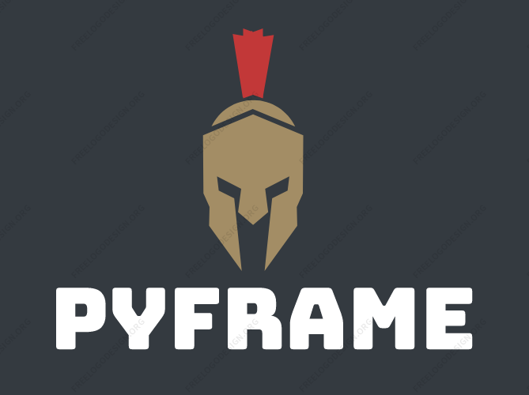

<p align=center>

  

  <br>
  <span> Framework made in Python used for teaching basic security</span>
  <br>

<p align="center">
  <a href="#installation">Installation</a>
  &nbsp;&nbsp;&nbsp;|&nbsp;&nbsp;&nbsp;
  <a href="#usage">Usage</a>
</p>


## Installation

```console
# clone the repo
$ git clone -b framework --single-branch https://github.com/BogdanTrufanda/ASET.git

# change the working directory to ASET
$ cd ASET

# install the requirements
$ python3 -m pip install -r requirements.txt

# clone sherlock repo
$ git clone https://github.com/sherlock-project/sherlock.git

# install searchsploit
$ git clone https://github.com/offensive-security/exploit-database.git /opt/exploit-database
$ ln -sf /opt/exploit-database/searchsploit /usr/local/bin/searchsploit
$ searchsploit -u
```

## Usage

```console
$ python3 main.py
```


